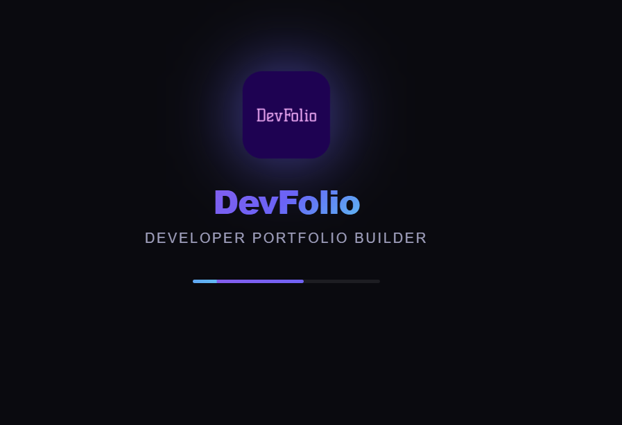
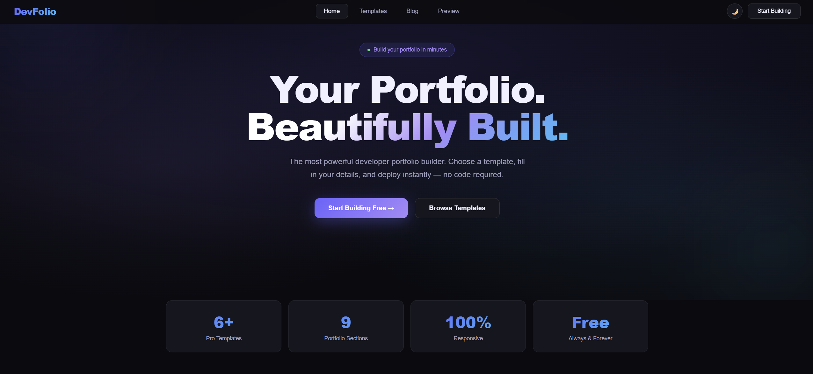
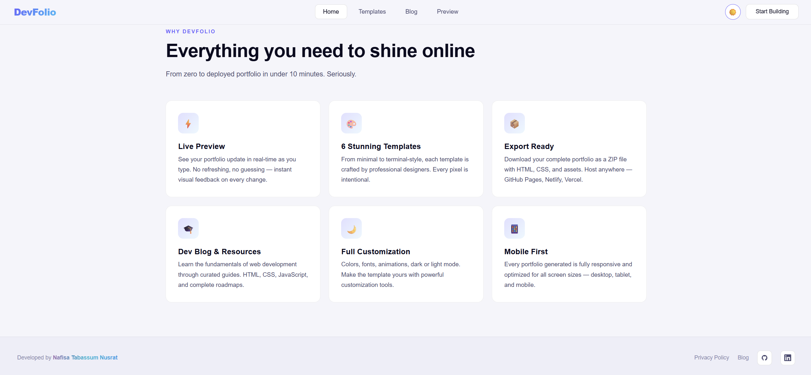
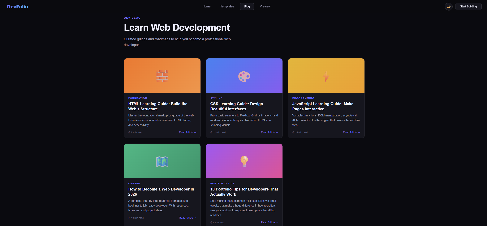
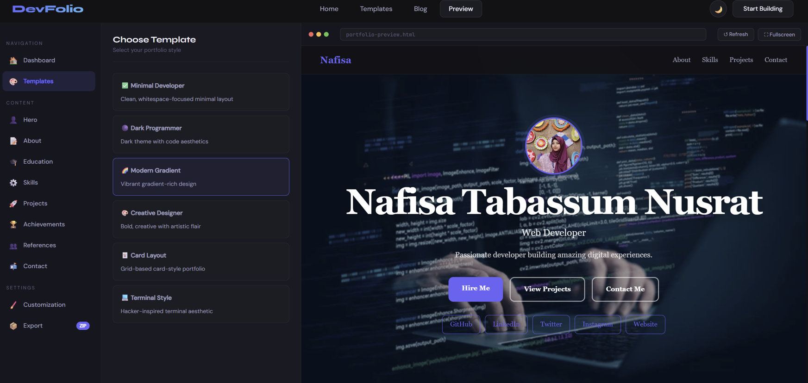

#Devfolio

<h3 align="center">
⚡ Build Stunning Developer Portfolios in Minutes
</h3>

DevFolio is a modern portfolio builder that helps developers create
beautiful personal portfolio websites without writing code.

---

# 🚀 About DevFolio

DevFolio is a **browser-based developer portfolio generator** designed for developers, students, designers, and creators who want a professional portfolio website quickly.

Instead of spending hours designing a portfolio from scratch, DevFolio allows you to:

✨ Choose a template  
✨ Add your information  
✨ Preview instantly  
✨ Export a ready-to-deploy portfolio

All within minutes.

---

# ✨ Core Features

### 🎨 Beautiful Templates
Choose from multiple modern portfolio layouts designed for developers.

Templates include:

• Minimal Developer  
• Dark Mode Portfolio  
• Gradient Modern Portfolio  
• Creative Designer Portfolio  
• Card Layout Portfolio  
• Terminal Style Portfolio

---

### ⚡ Live Portfolio Builder

Instantly preview your portfolio while editing.

✔ Real-time preview  
✔ No page refresh required  
✔ Instant UI updates

---
# 📸 Project Preview

### Code Editor Interface

Add your project screenshot here.

Example:

### 🧩 Complete Portfolio Sections

DevFolio helps you build a **complete professional portfolio** including:

• Hero Section  
• About Me  
• Education  
• Skills  
• Projects  
• Achievements  
• References  
• Contact Information

---

### 🎨 Customization Options

Make your portfolio unique.

Customize:

• Colors  
• Fonts  
• Layout styles  
• Animations  
• Theme appearance

---

### 🌗 Dark & Light Mode

Switch between beautiful themes.

✔ Dark mode for developers  
✔ Light mode for modern design

---

### 📱 Fully Responsive

Portfolios generated by DevFolio work perfectly on:

• Desktop  
• Tablet  
• Mobile devices

---

### 📦 Export Ready

Export your portfolio instantly as:

• Single HTML file  
• Complete website ZIP package

Deploy anywhere.

---

# 🖥 Live Preview System

DevFolio includes a powerful **preview engine** that lets users:

✔ See real-time portfolio updates  
✔ Preview templates instantly  
✔ Test layouts and UI  
✔ View fullscreen portfolio preview

---

# 🛠 Tech Stack

DevFolio is built using modern web technologies.

No frameworks required.

Everything runs **directly in the browser**.

---

# ⚡ How DevFolio Works

1️⃣ Choose a template  
2️⃣ Enter your personal details  
3️⃣ Add projects and skills  
4️⃣ Customize design  
5️⃣ Preview portfolio  
6️⃣ Export your website

You can build a full portfolio in **less than 10 minutes**.

---

# 🚀 Deployment

After exporting your portfolio you can deploy it anywhere.

### GitHub Pages
Upload your HTML file and enable Pages.

### Netlify
Drag & drop your portfolio ZIP file.

### Vercel

Your portfolio will be live instantly.

---

# 🔒 Privacy

DevFolio respects your privacy.

✔ No accounts required  
✔ No cookies  
✔ No tracking  
✔ No server storage

Everything runs **locally in your browser**.

Your data never leaves your device.

---

# 👩‍💻 Developer

Created by

### Nafisa Tabassum Nusrat

Front-End Web Developer  
AI Agent Developer
Future AI Engineer  
AI / ML Enthusiast  
Student at **Daffodil International University**

---

# 🌐 Connect With Me

---

# ⭐ Support the Project

If you like DevFolio:

⭐ Star the repository  
🍴 Fork the project  
💡 Suggest new features

Your support helps this project grow.

---

